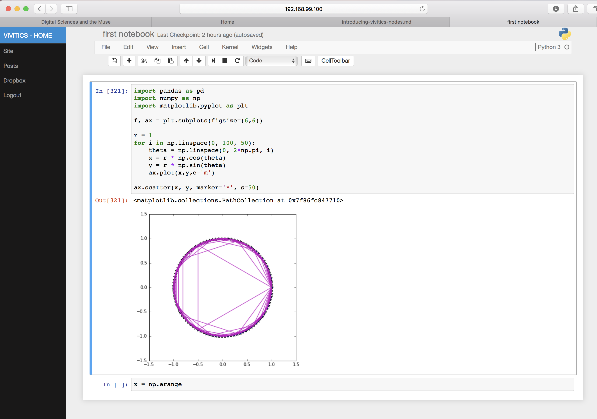

# Vivitics Node (VNode)

A workbench for Data Science powered by Jupyter and Docker which includes:

- Customized Jupyter notebook
- Dropbox integration for data persistence
- Built-in Markdown-based static blog using Pelican
- pgAdmin4 web app for SQL integration with Postgres / Greenplum
- Out of the box integration with VMWare and most public cloud providers

In many ways, VNode can be thought of as a distribution of the amazing [Project Jupyter](http://jupyter.org/) wherein VNode aims to incorporate some little conveniences in an extensible way.



With VNode you can build models locally, connect with your corporate
data sources, and collaborate with your team. If you need additional
resources you can easily use Spark, Hadoop, anything that can be
scripted to connect to from the VNode. If you prefer to simply replicate
your environment on a supercomputer in the cloud, you can do that too
with a few simple shell commands.

The default settings will create a VNode with Jupyter supporting Python
2, 3, Julia, and R. The web-enabled bash terminal and in-built conda
environment make adding and managing packages simple.

Note: VNode is experimental at this stage. It is not suitable for
production use and does not use SSL yet.

## Pre-requisites

* [Docker Engine](https://docs.docker.com/engine/) 1.10.0+
* [Docker Machine](https://docs.docker.com/machine/) 0.6.0+
* [Docker Compose](https://docs.docker.com/compose/) 1.6.0+
* A VM provider (this example uses virtualbox)

Installing VNodes on Windows does work fine however it can require some
extra steps depending on the environment along with Cygwin and Git bash
as pre-requisites. In addition, installing Docker can render virtualbox useless; install the engine binary without activating hypervisor to avoid this. If you are on a machine which uses Cisco's AnyConnect VPN, you'll notice that having the VPN active creates errors and leaves VNodes unreachable. The only workround for now is to remain out of VPN when using locally (although other fixes are available through manual configuration updates).

## Get Started

VNode name = VVM, VNode user = vivuser, Driver = virtualbox (local)

```bash
# create VNode's VM
$ DM_NAME=vvm MACHINE_DRIVER=virtualbox bash create.sh

# setup evars for docker
$ eval $(docker-machine env vvm1)

# generate vvm_notebook service from docker-stacks
$ VVM_USER=vivuser bash generate_vvmnb.sh

# build all VNode services in vvm_node.yml
$ VVM_USER=vivuser bash build.sh 

# start services
$ VVM_USER=vivuser bash up.sh
$ docker logs vvm_dropbox # obtain the dropbox activation link

# stop services
$ VVM_USER=vivuser bash down.sh

# to stop the VNode
$ VVM_USER=vivuser bash down.sh && docker-machine stop vvm
```

To use a non-local, environment like VMWare vSphere, Digital Ocean, Azure, AWS pick a supported docker-machine driver, set the evars and follow the same steps as above. Alternatively replace create.sh with your creation step. Here's an example with Digital Ocean:

```bash
$ docker-machine create --driver digitalocean \
    --digitalocean-access-token=<SECRET_DIGITALOCEAN_ACCESS_TOKEN> \
    --digitalocean-size='1gb' --digitalocean-region='nyc1' dovvm
$ eval $(docker-machine env dovvm)

# follow same steps from quickstart above.
```

# Additional notes
```bash
# get the notebook token from the VVM
$ bash open.sh

# Set desired jupyter impage (from jupyter/docker-stacks images)
$ NB_DSIMAGE=datascience-notebook bash vvm_node/build.sh

# remove all containers (use down.sh, but this can be helpful for
# intermediary containers
$ docker rm $(docker ps -aq)

# remove all volumes (useful for dev/test if needing to wipe data)
$ docker volume rm $(docker volume ls -q)
```

Canonical docker-stacks choices for $NB\_DSIMAGE:

- all-spark-notebook
- base-notebook
- datascience-notebook
- examples
- internal
- minimal-notebook
- pyspark-notebook
- r-notebook
- scipy-notebook
- tensorflow-notebook


## Author

**(c) Thomas Willey**
- <https://github.com/thomaswilley>
- <https://twitter.com/thomaswilley>

Additional copyrights included within source.

## License

Open sourced under the [AGPL 3.0](LICENSE).

## Reference & Further Reading

- https://github.com/jupyter/docker-stacks
- https://docs.getpelican.com/
- https://github.com/thomaswilley/pelicanyan
